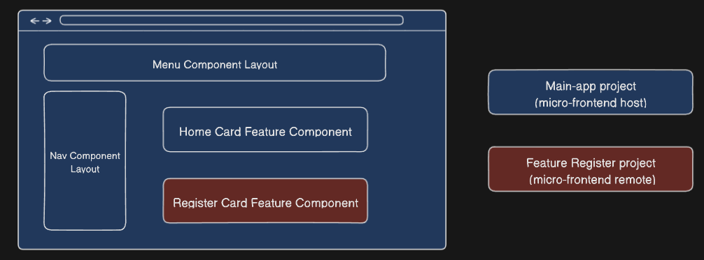

# Microfrontends using Next.js and Module Federation Architecture

`main-app` is the main application

`feature-register` is the second application that expose its pages and components

Using Module Federation NextJS Library :

https://github.com/module-federation/universe/tree/main

https://www.npmjs.com/package/@module-federation/nextjs-mf

We use :

- `webpack5` configuration to expose its module federation for each applications
- `next/dynamic` to import modules via webpack bundle

## Schema architecture




## How to Test setup 

- `main-app` will be run via http://localhost:3000
- `feature-register` will be run via http://localhost:3001

### Without docker (using your environment)

#### Requirements

- `pnpm`
- `node` version 18+

```sh
cd main-app
# copy and adapt your own .env if needed
cp .env.template .env 
pnpm install
pnpm run dev

cd feature-register
pnpm install
pnpm run dev

# use ./cli.sh clear in order to clean all pnpm stuff/node_modules
```

### Docker mode

the file `cli.sh` is available for each project in order to run your instance

```sh
cd main-app
# copy and adapt your own .env if needed
cp .env.template .env 
./cli.sh install runDev

cd feature-register
./cli.sh install runDev

# use ./cli.sh clear in order to clean all pnpm stuff/node_modules
```

### Extra command line

Please check all arguments in `cli.sh` and adapt it with/without docker for running lint/test/format...

